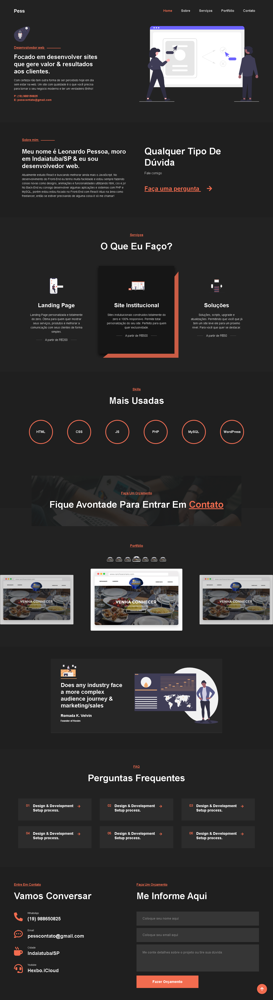

# Portfolio

  

 Site feito 100% por mim para treinar e revisar o HTML, CSS e o JavaScript e também para aplicar alguns aprendizados sobre design e coisas do tipo.
 
 O site é um portfolio em que eu consigo me apresentar e mostrar alguns trabalhos, serviços, contato, etc.
 
 Tentei criar tudo do zero pensando no passo a passo de como fazer cada coisa para forçar minha lógica, mas no fim eu consultei alguns projetos antigos e projetos de outras pessoas para ver realmente qual era a melhor forma de fazer! Usei muita coisa que aprendi no curso da Origamid e em outros estudos e esse foi um dos primeiros sites que eu fiz com JavaScript puro, então eu consegui práticar muito e testar várias coisas! O HTML foi bem tranquilo e aprendi um pouco mais de CSS também!

 ## Ferramentas
 
 No projeto foi utilizado:

 - HTML5
 - CSS3
 - JS
